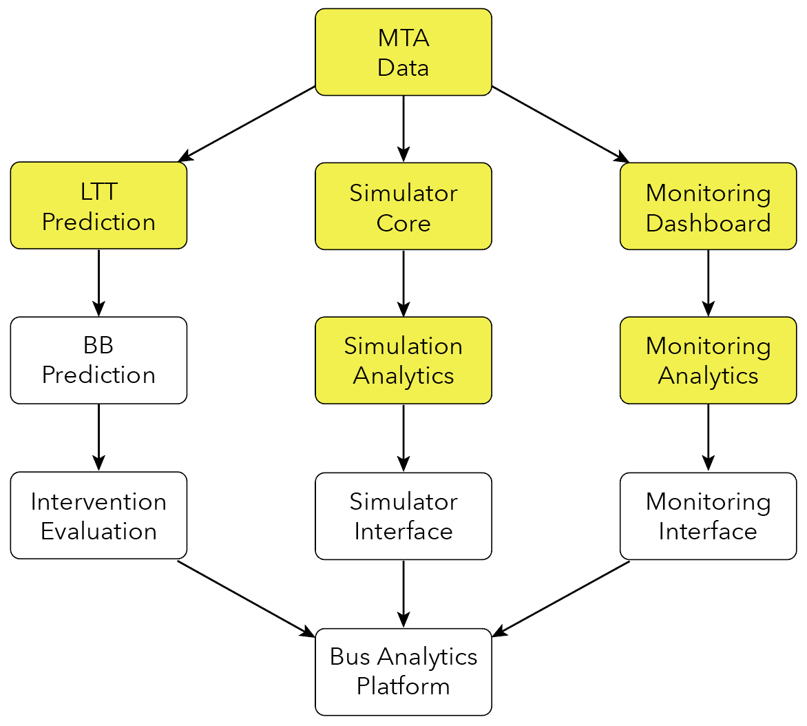
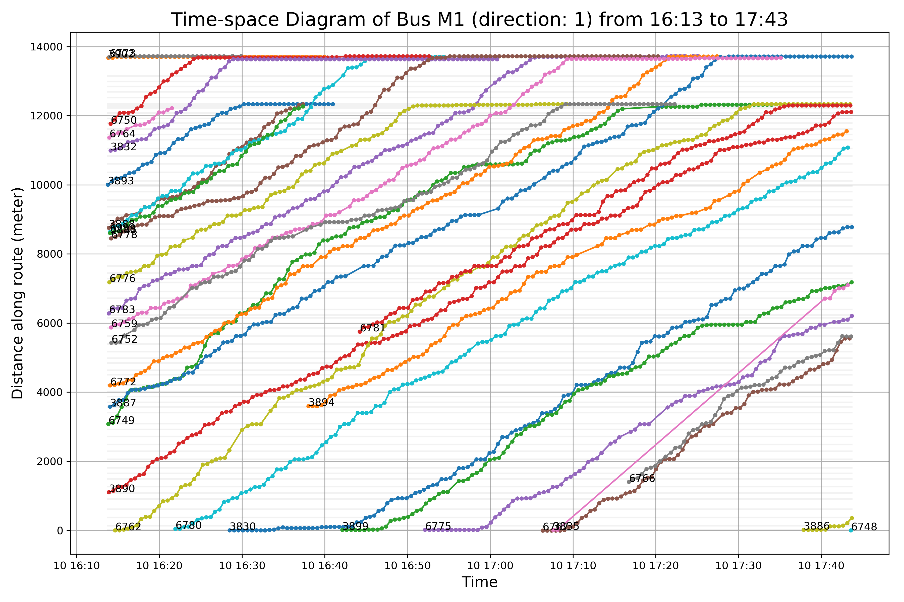
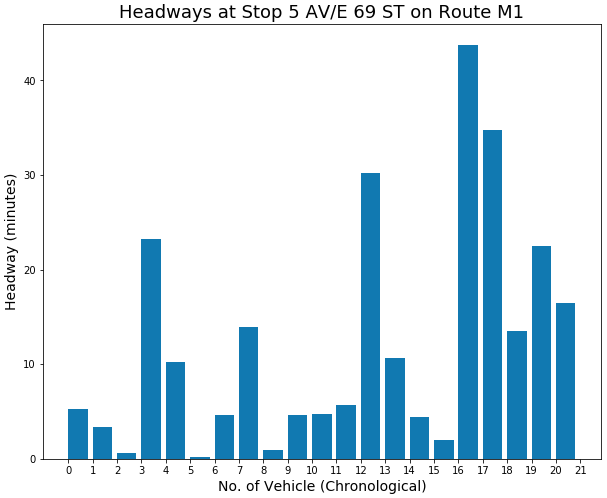

# Bus Analytics Toolkit for Bunching Mitigation

## A ready-to-use python toolkit for bus data streaming, analytics, and simulation with real-time, historical, and artificial bus trajectory data

Author: Yuwen Chang (M.S. at NYU CUSP 2018)

Project of [BUILT@NYU](https://github.com/BUILTNYU) led by Prof. Joseph Chow

## This toolkit is meant to be…

- A **simple** and **generalized** data pipeline for bus analytics
- A **simple** and **flexible** simulation environment for operation evaluation
- An **adaptable** and **scalable** approach for other cities given GTFS and SIRI

## Installation

`pip install buskit`

## Motivation

- How can we easily analyze bus trajectories and activities? How can we mitigate bus bunching? How do we know the effects of operational strategies such as holding or skipping on the services and passengers?
- While data is widely available, there is no single, open-source, and easy-to-use tool that let us monitor and analyze bus activity. This python toolkit aims to make the analysis pipeline both simple and flexible, with tasks ranging from monitoring real-time activities, fetching data for historical analysis, to simulating operation strategies to mitigate bus bunching.
- The dashboard and simulator can make use of real-time, historical as well as artificial data smoothly and can be easily applied to any city as long as they share the same data standards (GTFS, SIRI).
- The monitoring dashboard allows riders to spot unstable services in advance and operators to easily identify bunching scenarios. The simulation tool allows involved parties to try different bus control strategies to mitigate unreliable headways.
- To make the toolkit more accessible, a well-designed user interface is to be developed. The prototype simulator is still under development and will benefit from more specification and controls as well.

<!-- .element height="50%" width="50%" -->

## Data Streaming Functions

### busdata.stream_bus: Get bus data

Install through `pip` OR manually download the [script](buskit/buskit/busdata.py) OR clone the repo and import the functions to your Jupyter notebook or run it on command lines as the example below:

```python
# EXAMPLE #
# fetch bus data for route B54 for 1 minute (once per 30 secs)
# SBS lineref example: "S79%2B", which would be interpreted as "S79+"

### direct download and command line run ###
git clone https://github.com/ywnch/BusSimulator.git
python fetchbus.py $MTAAPIKEY "B54" 1

### pip download and run as module in Jupyter
pip install buskit # command line

from buskit import busdata as bdata
bdata.stream_bus(MTAAPI, "B54", 1)
```

### busdata.split_trips: Split different trips made by same vehicles

```python
# new vehicle reference number will have a trip no. suffix
df = split_trips(df)
df["NewVehicleRef"]
```

### busdata.plot_tsd: Plot time-space diagram

Import the functions and simply plot the dataframe as downloaded using `bus_data`.

```python
from buskit import busdata as bdata
# read the downloaded data
df = pd.read_csv("B54-180403-170417-5-Tue.csv")
# plot bus direction 1 in df starting from minute 10 to minute 30 and save it as TSD.png
bdata.plot_tsd(df, dir_ref=1, start_min=10, end_min=30, save=True, fname='TSD')
```

For more examples, see [example](example_busdata.ipynb).

## Objectives

1. Construct a simple environment with GUI that allow all users to simulate a given NYC bus route easily with essential variables. (May be expanded to other cities given a standard processed data feed, specifically GTFS and SIRI.)
2. For service operators: implement different bus bunching (BB) control strategies and evaluate their performances using real-world data.
3. For bus riders: signal alerts for unreliable service window along the route

## Workflow

1. Facilitate a data collection pipeline from NYC MTA bus real-time data ([Previous work](https://github.com/BUILTNYU/Monitoring-Bus-Arrivals-for-Headway-Control-Strategies) by Elsa Kong)
2. Construct a simulation environment in python
3. Implement a [BB mitigation strategy](https://www.sciencedirect.com/science/article/pii/S1568494616303118)
4. Evaluate the performance

## Current Output

1. Currently, we may use the `bus_data` function to fetch data of a specified route and direction at a given time window and then plot the time-space diagram with the `plot_tsd` function, both functions can be found in `fetchbus.py`. Below is a sample time-space diagram. (the x-axis is plot by recorded time instead, not time elapsed as shown here)



2. We may also use a conceptual dashboard to monitor real-time bus trajectories.


3. A prototype simulator that treat Bus and Stop as objects is also available


4. One of the benefits of objects is that we can record activities and events in a single bus or stop and examine the log easily, for example:




## Updates

[180317]
- Upload current sandbox
- Upload fetchbus.py script that generates real-time bus data

[180318]

- Update current sandbox
- Create light sandbox, currently developing route data query pipeline
- Update fetchbus.py script:
  - fix bugs
  - add `plot_tsd` function that plots time-space diagram of a given data
- Upload another sample historical AVL data

[180320]

- Update fetchbus.py script:
  - fix major plotting error
  - update plotting details

[180403] Data download part pretty much settled

- Update fetchbus.py script:
  - the function now stores every variable retrieved from MTA SIRI version 1 for each vehicle trajectory
  - modified naming convention of the file
- Update a new example file

[180407]

- Update fetchbus.py script:
  - update `plot_tsd` function according to new data format
  - now includes direction specification
  - now includes stops along the route in grey lines
- Updated GTFS route shape query workflow (only Manhattan data is up to date for now) in [viz sandbox](https://github.com/ywnch/BusSimulator/blob/master/sandbox_monitor.ipynb)

[180422]

- Create first simulation with Bus Class

[180423]

- Create Stop Class: simulator prototype now operable with artificial data
  - Includes pax arrival function
  - Now updates dwelling time based on pax at each stop
- Update [main sandbox](https://github.com/ywnch/BusSimulator/blob/master/sandbox_main.ipynb)
  - The flow is now streamlined up to current accomplishment across different pieces
  - A combined display of TSD and vehicle location is available with pseudo-real-time data (fed with pre-downloaded data)
  - The display provides BB identification
  - `CAVEAT:` currently, the plots are animated by overlaying new plots, thus the display can get very slow as the plots accumulate
  - Includes Google Map plotting block using `gmap` (Unavailable in JupyterLab)

[180425]

- Update main sandbox
  - Add route shapefile display with vehicle locations
  - Now available for both historical and real-time data feeds

[180429]

- Major updates after the Tandon Research Expo
- Temporarily wrapped some functions in `demo.py` to facilitate demonstration process

[180517]

- Major fix for `busdata.py` (renamed from fetchbus)
  - File naming convention changed (Day of week moved to the end)
  - `bus_data` is renamed as `stream_bus`
  - `split_trips` is added to help remove different trips by creating `NewVehicleRef`
  - Existing functions are optimized and are ready-to-use
  - `plot_tsd` now accepts time range arguments and print titles correctly
- For example, see [example](example_busdata.ipynb).

[180518]

- Now registered on PyPI as `buskit` ([version 1.0.0.dev1](https://pypi.org/project/buskit/))

## References

- Andres, M., & Nair, R. (2017). A predictive-control framework toaddress bus bunching. *Transportation Research Part B: Methodological*, *104*,123-148.
- Bartholdi III, J. J., & Eisenstein, D. D. (2012). Aself-coördinating bus route to resist bus bunching. *TransportationResearch Part B: Methodological*, *46*(4), 481-491.
- Camps, J. M., & Romeu, M. E. (2016). Headway Adherence. Detectionand Reduction of the Bus Bunching Effect. In *European TransportConference 2016Association for European Transport (AET)*.
- Carreón, G., Gershenson, C., & Pineda, L. A. (2017). Improvingpublic transportation systems with self-organization: A headway-based model andregulation of passenger alighting and boarding. *PLoS one*, *12*(12),e0190100.
- Daganzo, C. F. (2009). A headway-based approach to eliminate busbunching: Systematic analysis and comparisons. *Transportation ResearchPart B: Methodological*, *43*(10), 913-921.
- dos Santos Silva, F. A. (2017). Comparing Bus Travel Time PredictionUsing AVL and Smart Card Data.
- Feng, W., & Figliozzi, M. (2011a, January). Using archivedAVL/APC bus data to identify spatial-temporal causes of bus bunching. In *Proceedingsof the 90th Annual Meeting of the Transportation Research Board, Washington,DC, USA* (pp. 23-27).
- Feng, W., & Figliozzi, M. (2011b). Empirical findings of bus bunchingdistributions and attributes using archived AVL/APC bus data. In *ICCTP2011: Towards Sustainable Transportation Systems* (pp. 4330-4341).
- Kurkcu, A., Miranda, F., Ozbay, K., & Silva, C. T. (2017, June). Data visualization tool for monitoring transit operation and performance. In *Models and Technologies for Intelligent Transportation Systems (MT-ITS), 2017 5th IEEE International Conference on*(pp. 598-603). IEEE.
- Luo, X., Liu, S., Jin, P. J., Jiang, X., & Ding, H. (2017). Aconnected-vehicle-based dynamic control model for managing the bus bunchingproblem with capacity constraints. *Transportation Planning andTechnology*, *40*(6), 722-740.
- Mendes-Moreira, J., Jorge, A. M., de Sousa, J. F., & Soares, C.(2012). Comparing state-of-the-art regression methods for long term travel timeprediction. *Intelligent Data Analysis*, *16*(3), 427-449.
- Moreira-Matias, L., Cats, O., Gama, J., Mendes-Moreira, J., & deSousa, J. F. (2016). An online learning approach to eliminate Bus Bunching inreal-time. *Applied Soft Computing*, *47*, 460-482.
- Moreira-Matias, L., Ferreira, C., Gama, J., Mendes-Moreira, J., &de Sousa, J. F. (2012, July). Bus bunching detection by mining sequences ofheadway deviations. In *Industrial Conference on Data Mining*(pp.77-91). Springer, Berlin, Heidelberg.
- Moreira-Matias, L., Gama, J., Mendes-Moreira, J., & de Sousa, J.F. (2014, October). An incremental probabilistic model to predict bus bunchingin real-time. In *International Symposium on Intelligent Data Analysis* (pp.227-238). Springer, Cham.
- Pekel, E., & Soner Kara, S. (2017). A Comprehensive Review forArtificial Neural Network Application to Public Transportation. *Sigma:Journal of Engineering & Natural Sciences/Mühendislik ve Fen BilimleriDergisi*, *35*(1).
- Pilachowski, J. M. (2009). *An approach to reducing busbunching*. University of California, Berkeley.
- Yu, H., Wu, Z., Chen, D., & Ma, X. (2017). ProbabilisticPrediction of Bus Headway Using Relevance Vector Machine Regression. *IEEETransactions on Intelligent Transportation Systems*, *18*(7),1772-1781.

