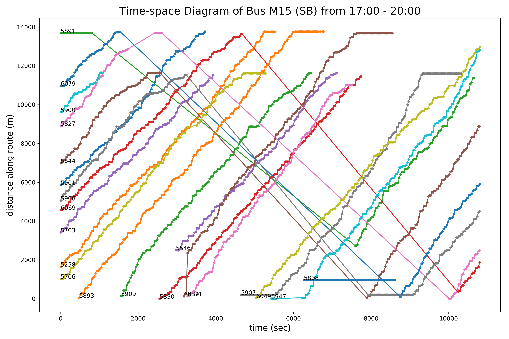

# Bus Simulator for Bus Bunching Mitigation

## A simple bus simulation environment for bus bunching analysis in New York City

Author: Yuwen Chang (M.S. at NYU CUSP 2018)

Instructor: Joseph Chow

## Objectives

1. Construct a simple environment with GUI that allow one to simulate a given NYC bus route easily with essential variables.
2. Implement different bus bunching (BB) control strategies and evaluate their performances using real-world data.

## Workflow

1. Facilitate a data collection pipeline from NYC MTA bus real-time data ([Previous work](https://github.com/BUILTNYU/Monitoring-Bus-Arrivals-for-Headway-Control-Strategies) by Elsa Kong)
2. Construct a simulation environment in python
3. Implement a [BB mitigation strategy](https://www.sciencedirect.com/science/article/pii/S1568494616303118)
4. Evaluate the performance

## Current Output

1. Currently, we may use the `bus_data` function to fetch data of a specified route and direction at a given time window and then plot the time-space diagram with the `plot_tsd` function, both functions can be found in `fetchbus.py`. Below is a sample time-space diagram. (the x-axis is plot by recorded time instead, not time elapsed as shown here)

## Updates

[180317]
- Upload current sandbox
- Upload fetchbus.py script that generates real-time bus data

[180318]

- Update current sandbox
- Create light sandbox, currently developing route data query pipeline
- Update fetchbus.py script:
  - fix bugs
  - add `plot_tsd` function that plots time-space diagram of a given data
- Upload another sample historical AVL data

[180320]

- Update fetchbus.py script:
  - fix major plotting error
  - update plotting details